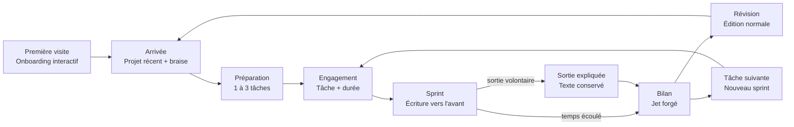

# Phase 0 — Parcours, wireflows et direction d'expérience

## Parcours principal



## États critiques

### 0. Onboarding de première visite

- Expliquer la séparation entre premier jet et correction avant de présenter le tableau de bord.
- Faire essayer une première phrase et le choix d'un résultat plutôt que de montrer des écrans purement promotionnels.
- Expliquer explicitement la sauvegarde, la sortie sans perte et la révision libre.
- Permettre de passer l'onboarding immédiatement et ne pas le répéter une fois terminé.

### 1. Arrivée

- Montrer le nom LaForge, le projet récent et l'état de braise.
- Donner la priorité absolue aux trois tâches et au prochain jet.
- Garder l'historique et les réglages en retrait.
- Si aucune tâche n'existe, transformer directement la première carte en champ de saisie.

### 2. Préparation

- Une tâche est sélectionnée à la fois.
- Les deux autres tâches montrent la suite sans rivaliser avec l'action active.
- Le quatrième ajout est impossible ; l'interface explique qu'il faut terminer, remplacer ou archiver une tâche.
- Les conseils de reformulation apparaissent sous le champ, sans validation bloquante.

### 3. Engagement

- La durée de 15 minutes est sélectionnée par défaut.
- Les options rapides sont `5`, `15`, `25` et `45 min`, plus une durée personnalisée.
- L'objectif de mots est avancé et facultatif.
- Le bouton principal nomme précisément l'action : `Forger 15 min`.

### 4. Sprint

- Le focus entre directement dans l'éditeur.
- La tâche active reste visible dans une ligne compacte.
- Le temps restant et l'état de sauvegarde occupent les coins opposés.
- Les anciens paragraphes perdent progressivement du contraste, mais restent accessibles aux technologies d'assistance.
- Les actions de navigation et de gestion disparaissent.
- `Échap` n'arrête rien sans ouvrir la sortie expliquée.

### 5. Sortie volontaire

- La sortie est accessible par un libellé discret mais lisible.
- La feuille explique : le jet s'arrête, le texte est conservé, la tâche reste ouverte.
- L'action destructive est l'arrêt du sprint, jamais la suppression du texte.
- Reprendre l'écriture ferme instantanément la feuille.

### 6. Bilan

- À la fin naturelle du temps, une montre mécanique occupe l’écran pendant 4,2 secondes et rend l’arrêt du sprint impossible à manquer.
- Le tic-tac et la sonnerie restent contrôlables par un bouton explicite ; le texte est conservé même si l’audio est indisponible.
- Après ce signal bref, le texte se déverrouille automatiquement dans le bilan.
- Les chiffres apparaissent comme preuve d'effort, pas comme score.
- La carte de jet rejoint visuellement l'historique.
- Deux actions dominent : `Réviser le texte` et `Tâche suivante`.

## Wireflow desktop

```text
┌──────────────────────────────────────────────────────────────────────────┐
│ LaForge                       Mémoire de master             Braise ●●●○  │
├──────────────────────────────────────────────────────────────────────────┤
│ Aujourd'hui                                                              │
│                                                                          │
│  ┌─ 01 ────────────────────────────────────────────────────────────────┐  │
│  │ Rédiger l'ouverture du chapitre sur la confiance numérique         │  │
│  │ Premier résultat · sélectionnée                                    │  │
│  └─────────────────────────────────────────────────────────────────────┘  │
│  ┌─ 02 ─────────────────────────────┐ ┌─ 03 ─────────────────────────┐   │
│  │ Expliquer les trois tensions     │ │ Esquisser la conclusion      │   │
│  └──────────────────────────────────┘ └───────────────────────────────┘   │
│                                                                          │
│  Durée   [ 5 ] [ 15 ] [ 25 ] [ 45 ]             [ Forger 15 min  → ]   │
└──────────────────────────────────────────────────────────────────────────┘
                                  │
                                  ▼
┌──────────────────────────────────────────────────────────────────────────┐
│ ← Sortir       Rédiger l'ouverture…              14:32 · Sauvegardé     │
│                                                                          │
│              Écris la première version.                                 │
│              Tu pourras la façonner ensuite.                            │
│                                                                          │
│              Le curseur reste ici, toujours vers l'avant.               │
│              Les paragraphes précédents s'estompent doucement.          │
│                                                                          │
│              ▍                                                           │
└──────────────────────────────────────────────────────────────────────────┘
                                  │
                                  ▼
┌──────────────────────────────────────────────────────────────────────────┐
│                              Jet forgé                                   │
│                         15 min · 326 mots                                │
│                                                                          │
│              Tu as créé de la matière. La correction vient après.       │
│                                                                          │
│                   [ Réviser ]   [ Tâche suivante → ]                     │
└──────────────────────────────────────────────────────────────────────────┘
```

## Wireflow mobile

```text
┌────────────────────────────┐
│ LaForge             ●●●○   │
│ Mémoire de master          │
│                            │
│ Aujourd'hui                │
│ ┌────────────────────────┐ │
│ │ 01                     │ │
│ │ Rédiger l'ouverture    │ │
│ │ du chapitre…           │ │
│ └────────────────────────┘ │
│ ┌────────────────────────┐ │
│ │ 02  Expliquer les…     │ │
│ └────────────────────────┘ │
│ ┌────────────────────────┐ │
│ │ 03  Esquisser la…      │ │
│ └────────────────────────┘ │
│                            │
│ 5   [15]   25   45         │
│ ┌────────────────────────┐ │
│ │     Forger 15 min →    │ │
│ └────────────────────────┘ │
└────────────────────────────┘
             │
             ▼
┌────────────────────────────┐
│ Sortir       14:32          │
│ Rédiger l'ouverture…        │
│                            │
│ Écris la première version. │
│ Tu la façonneras ensuite.  │
│                            │
│ Le curseur reste ici ▍     │
│                            │
│                            │
│ ● Sauvegardé               │
└────────────────────────────┘
```

## Direction visuelle : la forge calme

La métaphore de la forge doit apparaître dans la chaleur, la matière et le vocabulaire, jamais comme un décor médiéval littéral.

### Palette

- **Ivoire chaud** pour le fond : une page accueillante, moins clinique que le blanc.
- **Graphite** pour le texte et les surfaces structurantes.
- **Braise** orange-rouge comme accent rare : action principale, progression, réussite.
- **Cuivre sourd** pour les états secondaires.
- **Cendre** pour les séparations, métadonnées et textes qui s'estompent.

L'accent braise ne colore jamais de grandes surfaces pendant l'écriture. Il doit rester désirable parce qu'il est rare.

### Typographie

- Interface : fonte système lisible et rapide, avec chiffres tabulaires pour le minuteur.
- Titres : graisse affirmée, approche légèrement resserrée, lignes courtes.
- Éditeur : serif de lecture disponible localement, taille généreuse et interligne confortable.
- Aucun texte essentiel en capitales longues ; les labels courts peuvent utiliser une petite capitale espacée.

### Matière et profondeur

- La zone d'écriture ressemble à une feuille claire engagée dans un outil mécanique, jamais à un champ de formulaire numérique.
- L'encre, le papier ivoire, les ombres de feuilles superposées et la typographie monospacée portent la sensation analogique.
- Surfaces opaques pour les zones de lecture et texture de papier extrêmement discrète sur le fond.
- Translucidité seulement pour le chrome flottant et la feuille de sortie.
- Contrôles identifiables par une forme angulaire, un bord, un reflet supérieur et une ombre noire de contact clairement visible.
- Surfaces principales plus profondes que les contrôles qu'elles contiennent, sans empiler des cartes décoratives.
- La pression réduit l'ombre et enfonce légèrement le contrôle pour donner un retour physique immédiat.
- Angles francs ou très faiblement adoucis : la matière évoque une plaque forgée, alignée et précise, jamais une collection de bulles.

## Principes de mouvement

| Moment | But | Mouvement |
| --- | --- | --- |
| Pression d'un bouton | Feedback | `translateY(1px)` + ombre raccourcie, 120 ms, ease-out forte |
| Passage au sprint | Continuité spatiale | Le panneau actif s'étend et le chrome s'efface, 220–240 ms |
| Changement de tâche | État | Transition de couleur quasi instantanée, sans déplacement décoratif |
| Feuille de sortie | Compréhension spatiale | Entrée depuis le bas sur mobile, fondu centré sur desktop, 240 ms |
| Temps écoulé | Indication d’état rare | Montre mécanique plein écran pendant 4,2 s, puis passage automatique au bilan |
| Fin d'un jet | Récompense rare | Trait de braise + carte qui se matérialise, 260 ms maximum |
| Saisie clavier | Fréquence élevée | Aucune animation par caractère |

Toutes les translations sont supprimées avec `prefers-reduced-motion`. Les changements d'opacité et de couleur utiles restent présents.

## Ton rédactionnel

LaForge parle comme un entraîneur calme : direct, concret, jamais culpabilisant.

| Éviter | Préférer |
| --- | --- |
| Tu as échoué à terminer | Ton texte est conservé. Tu pourras reprendre ce jet. |
| Ne casse pas ta série ! | Ta braise peut repartir avec un seul jet. |
| Objectif raté | 184 mots de matière créés. |
| Êtes-vous sûr de vouloir quitter ? | Arrêter ce jet ? Le texte restera disponible. |
| Commencer | Forger 15 min |

## Critères d'acceptation du MVP

1. Une nouvelle personne peut expliquer le produit après l'onboarding de première visite.
2. Un premier sprint peut commencer en moins de 30 secondes sans compte.
3. Une personne de retour peut reprendre en trois actions maximum.
4. Pendant le sprint, aucune action ordinaire ne permet de modifier le texte antérieur.
5. Recharger la page ne remet ni le temps ni le texte à zéro.
6. Une sortie volontaire conserve le texte et explique clairement ce qui change.
7. La fin déverrouille le texte et propose une prochaine action évidente.
8. Les trois parcours critiques fonctionnent au clavier et avec un lecteur d'écran.
9. Le mode mouvement réduit évite les translations et effets de profondeur.
10. Aucune donnée textuelle n'est envoyée à une analytique.

## Hors périmètre du MVP

- comptes, authentification et synchronisation cloud ;
- collaboration et partage ;
- génération ou correction par IA ;
- formatage riche avancé ;
- import complexe et export PDF ;
- marketplace de modèles ;
- blocage d'applications ou de sites externes ;
- notifications push ;
- classement, monnaie virtuelle ou récompenses aléatoires ;
- paiement et offre équipe.
